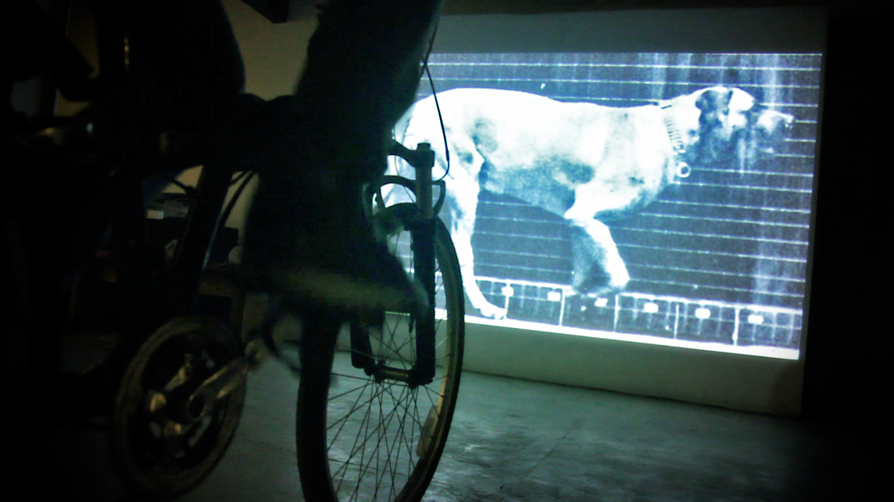

# Giro

GIRO é uma instalação interativa aonde convida o público a pedalar uma bicicleta e controlar a velocidade da exibição dos frames de um filme projetado em sua frente. 

Ao pedalar, as imagens ganham movimento e se comportam da mesma forma que um projetor de cinema funciona, só que nesse caso é o ciclista que fornece a fonte de energia para controlar a velocidade dos frames. 

O corpo como motor e a bicicleta-cinema. Esse projeto é também uma homenagem a Eadweard Muybridge e sua contribuição para o cinema.

## Autores

Harrison Mendonça [@euharrison](https://github.com/euharrison)
Daniel Tumati